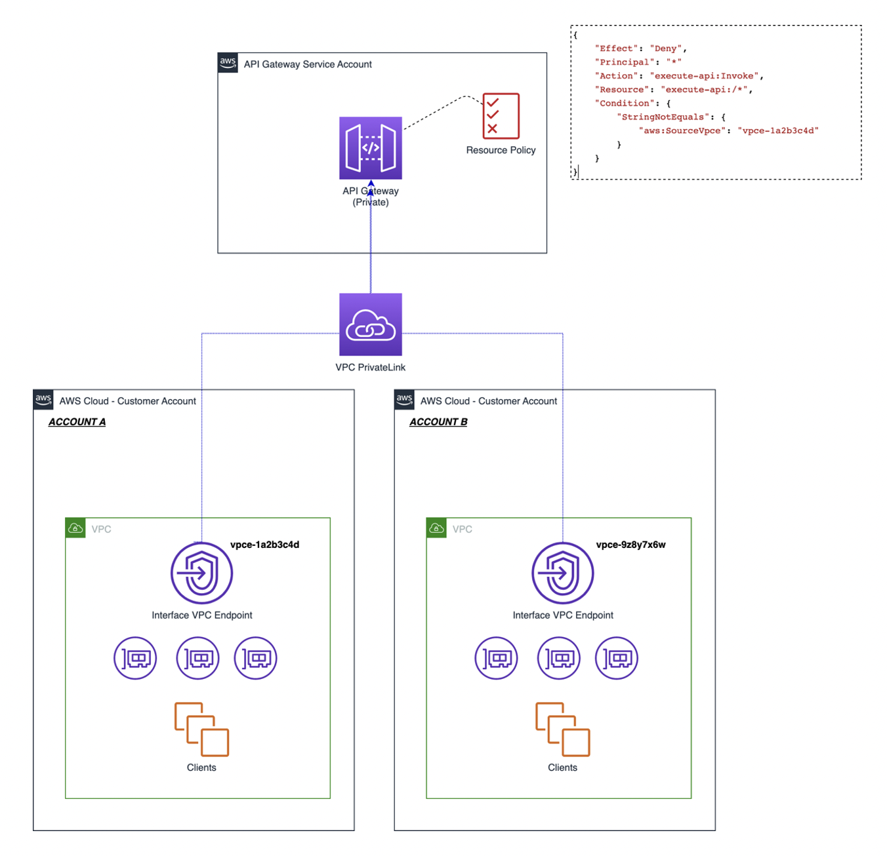

```ad-attention
title: This is a github note

```
# How can I access an API Gateway private REST API in another AWS account using an interface VPC endpoint

[KB](https://aws.amazon.com/premiumsupport/knowledge-center/api-gateway-private-cross-account-vpce/?nc1=h_ls) 



## Account A
- create vpc & `execute-api` endpoint
- no peering or tgw needed


## API gateway service Account
### access-control-with-cidr
not works. 下面禁止语句既不能禁止本账号`10.1.0.0/16`段访问api，也不能禁止跨账号`10.3.0.0/16`段访问API

```json
{
    "Version": "2012-10-17",
    "Statement": [
        {
            "Effect": "Deny",
            "Principal": "*",
            "Action": "execute-api:Invoke",
            "Resource": "execute-api:/*/*/*",
            "Condition": {
                "IpAddress": {
                    "aws:SourceIp": "10.0.0.0/8"
                }
            }
        },
        {
            "Effect": "Allow",
            "Principal": "*",
            "Action": "execute-api:Invoke",
            "Resource": "execute-api:/*/*/*"
        }
    ]
}
```

### access-control-with-vpce
works.

```json
{
  "Version": "2012-10-17",
  "Statement": [
    {
      "Effect": "Deny",
      "Principal": "*",
      "Action": "execute-api:Invoke",
      "Resource": "execute-api:/*/*/*",
      "Condition": {
        "StringNotEquals": {
          "aws:sourceVpce": ["vpce-0e8c7218143473b45","vpce-05d29a86dd2360259"]
        }
      }
    },
    {
      "Effect": "Allow",
      "Principal": "*",
      "Action": "execute-api:Invoke",
      "Resource": "execute-api:/*/*/*"
    }
  ]
}

```

### access-control-with-vpc
works

```json
{
    "Version": "2012-10-17",
    "Statement": [
        {
            "Effect": "Deny",
            "Principal": "*",
            "Action": "execute-api:Invoke",
            "Resource": "execute-api:/*/*/*",
            "Condition": {
                "StringNotEquals": {
                    "aws:sourceVpc": "vpc-0204a5003748eb870"
                }
            }
        },
        {
            "Effect": "Allow",
            "Principal": "*",
            "Action": "execute-api:Invoke",
            "Resource": "execute-api:/*/*/*"
        }
    ]
}
```

### deploy
- redeploy after you change `Resource Policy`


