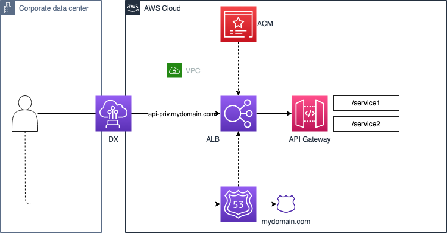
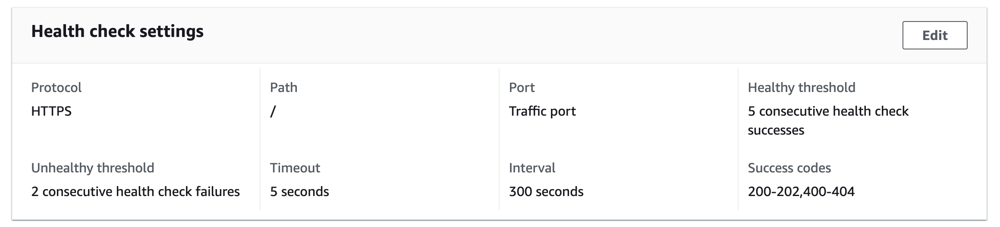

```ad-attention
title: This is a github note

```
# AWS CDK Private API and Application Load Balancer Demo

https://github.com/markilott/aws-cdk-internal-private-api-demo



## prep
- 创建 host zone 可以被你的域名解析到 （在上游 route53 添加 NS 记录）
- 创建新vpc，不要创建 api gateway 的 endpoint
- 创建 cloud9 在新 vpc

## lab setup
- clone repo
- execute in repo folder
```sh
npm install
cdk bootstrap
```

- edit `config/index.ts`
```js
export const options = {
    vpcAttr: {
        customVpcId: '',
        // These are the AWS default VPC subnets. Update to your own CIDR's if using a custom VPC
        subnetCidr1: '172.31.128.0/20',
        subnetCidr2: '172.31.144.0/20',
    },
    createCertificate: true,
    certificateArn: '',
    dnsAttr: {
        zoneName: 'apixxxx.aws.panlm.xyz',
        hostedZoneId: 'Z036xxxxxxPMWxxxxxxOP',
    },
    albHostname: 'test-alb',
    apiPath1: 'test-api1',
    apiPath2: 'test-api2',
};
```

- deploy
```sh
cdk deploy --all
```

## data flow





