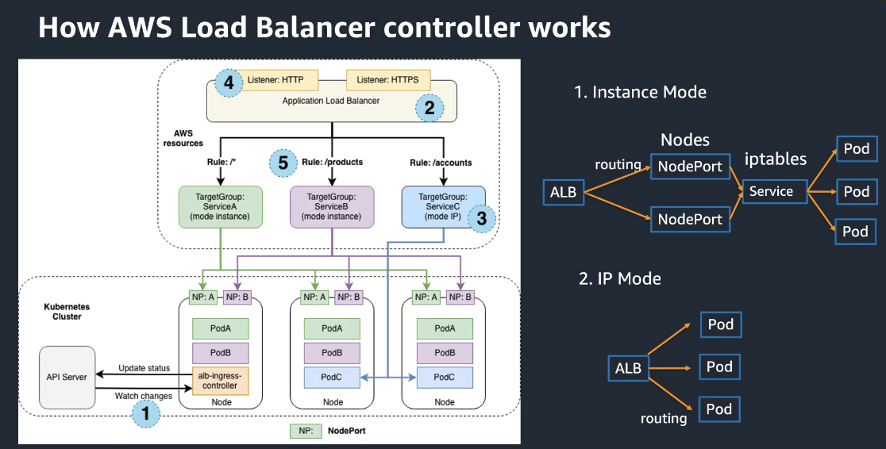

> [!WARNING] This is a github note

# aws-load-balancer-controller

## github
- https://github.com/kubernetes-sigs/aws-load-balancer-controller
- https://kubernetes-sigs.github.io/aws-load-balancer-controller/v2.4/how-it-works/


## workshop
- [[awslbc-ingress-lab-echoserver#install echoserver-]]
- https://www.eksworkshop.com/beginner/180_fargate/prerequisites-for-alb/
- 常用ingress的相关配置 ([[awslbc-ingress-settings]])
- 使用已有ingress的相关配置 ([[awslbc-ingress-settings-ingress-group]])
- pod rediness gate ([link](https://kubernetes-sigs.github.io/aws-load-balancer-controller/v2.4/deploy/pod_readiness_gate/))

## install
### install-with-eksdemo-
- https://github.com/awslabs/eksdemo/blob/main/docs/install-awslb.md
- remove service account if existed 
```sh
echo ${CLUSTER_NAME}
eksctl delete iamserviceaccount -c ${CLUSTER_NAME} \
    --name aws-load-balancer-controller --namespace kube-system
```
- create 
```sh
echo ${CLUSTER_NAME}
echo ${AWS_DEFAULT_REGION}

eksdemo install aws-lb-controller -c ${CLUSTER_NAME} --namespace kube-system 
```
^yddjq0

### install-
- https://kubernetes-sigs.github.io/aws-load-balancer-controller/v2.4/deploy/installation/
- Install AWS Load Balancer Controller
```sh
CLUSTER_NAME=ekscluster1
AWS_REGION=us-east-2
export AWS_DEFAULT_REGION=${AWS_REGION}
export AWS_PAGER=""

eksctl utils associate-iam-oidc-provider \
  --cluster ${CLUSTER_NAME} \
  --approve

# curl -o iam_policy.json https://raw.githubusercontent.com/kubernetes-sigs/aws-load-balancer-controller/v2.4.1/docs/install/iam_policy.json
git clone https://github.com/kubernetes-sigs/aws-load-balancer-controller.git

# check iamserviceaccount has been create by eksctl
aws cloudformation describe-stacks --stack-name eksctl-${CLUSTER_NAME}-addon-iamserviceaccount-kube-system-aws-load-balancer-controller 2>&1 1>/dev/null
if [[ $? -ne 0 ]]; then

if [[ ${AWS_REGION%%-*} == "cn" ]]; then 
  # aws china region
  IAM_POLICY_TEMPLATE=iam_policy_cn.json 
else
  # aws commercial region
  IAM_POLICY_TEMPLATE=iam_policy.json 
fi
cp aws-load-balancer-controller/docs/install/${IAM_POLICY_TEMPLATE} .

policy_name=AWSLoadBalancerControllerIAMPolicy-`date +%m%d%H%M`
policy_arn=$(aws iam create-policy \
  --policy-name ${policy_name}  \
  --policy-document file://${IAM_POLICY_TEMPLATE} \
  --query 'Policy.Arn' \
  --output text)

eksctl create iamserviceaccount \
  --cluster=${CLUSTER_NAME} \
  --namespace=kube-system \
  --name=aws-load-balancer-controller \
  --role-name=${policy_name} \
  --attach-policy-arn=${policy_arn} \
  --override-existing-serviceaccounts \
  --approve

# check iamserviceaccount has been create by eksctl
fi

helm repo add eks https://aws.github.io/eks-charts
helm repo update

# following helm cmd will fail if you use 3.9.0 version
# downgrade to helm 3.8.2
# and another solved issue is here: [[ingress-controller-lab-issue]]
if [[ ${AWS_REGION%%-*} == "cn" ]]; then 
  # aws china region
  helm upgrade -i aws-load-balancer-controller eks/aws-load-balancer-controller \
	-n kube-system \
	--set clusterName=${CLUSTER_NAME} \
	--set serviceAccount.create=false \
	--set serviceAccount.name=aws-load-balancer-controller \
	--set image.repository=961992271922.dkr.ecr.cn-northwest-1.amazonaws.com.cn/amazon/aws-load-balancer-controller \
	# --set region=${AWS_DEFAULT_REGION} \
	# --set vpcId=${VPC_ID} 
else
  # aws commercial region
  helm install aws-load-balancer-controller eks/aws-load-balancer-controller \
	-n kube-system \
	--set clusterName=${CLUSTER_NAME} \
	--set serviceAccount.create=false \
	--set serviceAccount.name=aws-load-balancer-controller 
fi

kubectl get deployment -n kube-system aws-load-balancer-controller

```

- [[awslbc-ingress-controller-lab-issue]]

### install-in-china-region
```sh
# using china region ecr url
helm upgrade -i aws-load-balancer-controller \
    eks/aws-load-balancer-controller \
    -n kube-system \
    --set clusterName=${CLUSTER_NAME} \
    --set serviceAccount.create=false \
    --set serviceAccount.name=aws-load-balancer-controller \
    --set image.repository=961992271922.dkr.ecr.cn-northwest-1.amazonaws.com.cn/amazon/aws-load-balancer-controller \
    # --set region=${AWS_DEFAULT_REGION} \
    # --set vpcId=${VPC_ID} 

```

find registry url from [[eks-container-image-registries-url-by-region]]
using parameter `image.repository`  (refer [LINK](https://github.com/kubernetes-sigs/aws-load-balancer-controller/tree/main/helm/aws-load-balancer-controller))

if you got `ImagePullBackOff`, could replace domain name as following
```sh
kubectl -n kube-system edit deployment aws-load-balancer-controller

```

```
# https://docs.aws.amazon.com/eks/latest/userguide/add-ons-images.html
# add `.cn` postfix for china region
REGISTRY=602401143452.dkr.ecr.us-east-1.amazonaws.com
# REGISTRY=961992271922.dkr.ecr.cn-northwest-1.amazonaws.com.cn

```


## upgrade
- [Migrate v1 to v2](https://kubernetes-sigs.github.io/aws-load-balancer-controller/v2.5/deploy/upgrade/migrate_v1_v2/) 

### Supported Kubernetes versions
- AWS Load Balancer Controller v2.0.0~v2.1.3 requires Kubernetes 1.15+
- AWS Load Balancer Controller v2.2.0~v2.3.1 requires Kubernetes 1.16-1.21
- AWS Load Balancer Controller v2.4.0+ requires Kubernetes 1.19+
- AWS Load Balancer Controller v2.5.0+ requires Kubernetes 1.22+
- AWS Load Balancer Controller v2.6.0+ requires Kubernetes 1.22+
- AWS Load Balancer Controller v2.7.0+ requires Kubernetes 1.22+

### check version
```sh
helm list -n kube-system
```


## in private cluster
如果节点组无法访问公网，则创建 ingress 时感觉很慢，约 5-6 分钟才能看到 alb，分析日志看到，创建 alb 过程中会访问 `shield` 和 `wafv2` 等服务时超时导致


## blog
- [[How To Expose Multiple Applications on Amazon EKS Using a Single Application Load Balancer]]
- [[Expose Amazon EKS pods through cross-account load balancer]] 
- [[../../../../WebClip/Enabling mTLS with ALB in Amazon EKS  Containers|Enabling mTLS with ALB in Amazon EKS  Containers]] 


## refer




