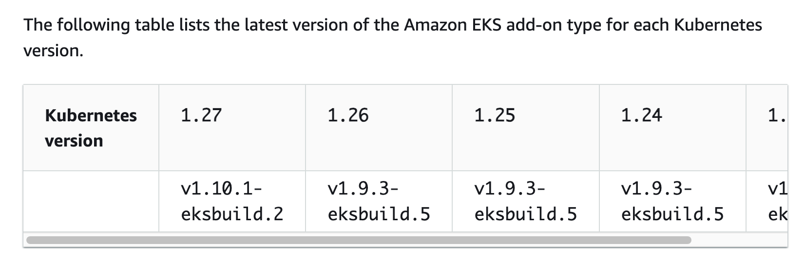

# eks-addons-coredns

## github

- [doc](https://docs.aws.amazon.com/eks/latest/userguide/managing-coredns.html) 

latest version


To improve the stability and availability of the CoreDNS Deployment, versions `v1.9.3-eksbuild.5` and later and `v1.10.1-eksbuild.2` are deployed with a `PodDisruptionBudget`. If you've deployed an existing `PodDisruptionBudget`, your upgrade to these versions might fail. If the upgrade fails, completing one of the following tasks should resolve the issue:
- When doing the upgrade of the Amazon EKS add-on, choose to override the existing settings as your conflict resolution option. 
- Remove your existing `PodDisruptionBudget` and try the upgrade again.

## updating

### from cli

```sh
CLUSTER_NAME=ekscluster1
export AWS_DEFAULT_REGION=us-east-2
aws eks describe-addon --cluster-name ${CLUSTER_NAME} \
--addon-name coredns --query "addon.addonVersion" --output text

aws eks update-addon --cluster-name ${CLUSTER_NAME} \
--addon-name coredns --addon-version v1.9.3-eksbuild.5 \
--resolve-conflicts PRESERVE 
#--configuration-values '{"replicaCount":3}'
    
```

### from webui

select `PRESERVE` 

## others

- [[managed-coredns]]
- [[self-managed-coredns]]

## monitoring

- https://coredns.io/plugins/metrics/
- https://docs.aws.amazon.com/eks/latest/best-practices/monitoring_eks_workloads_for_network_performance_issues.html
    - conntrack_allowance_exceeded
- https://aws.amazon.com/blogs/mt/monitoring-coredns-for-dns-throttling-issues-using-aws-open-source-monitoring-services/

## refer

- https://github.com/coredns/deployment/blob/master/kubernetes/Upgrading_CoreDNS.md

