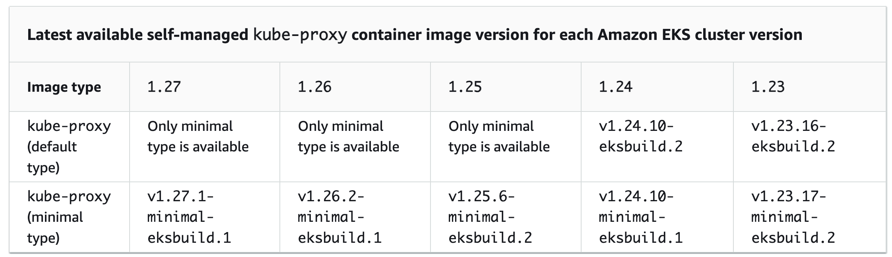

# eks-addons-kube-proxy

## github
- [doc](https://docs.aws.amazon.com/eks/latest/userguide/managing-kube-proxy.html)

There are two types of the `kube-proxy` container image available for each Amazon EKS cluster version:
- **Default** – This image type is based on a Debian-based Docker image that is maintained by the Kubernetes upstream community.    
- **Minimal** – This image type is based on a [minimal base image](https://gallery.ecr.aws/eks-distro-build-tooling/eks-distro-minimal-base-iptables) maintained by Amazon EKS Distro, which contains minimal packages and doesn't have shells. For more information, see [Amazon EKS Distro](https://distro.eks.amazonaws.com/).



```sh
aws eks describe-addon-versions --addon-name kube-proxy |jq -r '.addons[].addonVersions[].addonVersion'
```


## 给不太懂 Kubernetes 的开发人员介绍 kube-proxy、conntrack 和 K8s 网络传输

根据我搜索到的资料,我为你整理了以下内容和参考资源:

### 📚 推荐的学习资源

#### 1. 最佳入门文章
- **[Tracing the path of network traffic in Kubernetes](https://learnk8s.io/kubernetes-network-packets)** - 这篇文章非常适合初学者,用图文并茂的方式解
释了:
  - Pod 内部容器如何通信
  - 同节点 Pod 之间如何通信
  - 跨节点 Pod 之间如何通信
  - Pod 到 Service 的流量如何转发
  - 包含大量清晰的架构图和动画

#### 2. 中文深度解析
- **[Deep Dive kube-proxy with iptables mode](https://serenafeng.github.io/2020/03/26/kube-proxy-in-iptables-mode/)** - 详细讲解了:
  - kube-proxy 的三种模式(userspace, iptables, IPVS)
  - iptables 链的工作流程
  - 实际的 iptables 规则示例
  - 包含完整的实践案例

#### 3. 架构图资源
- **[Cilium k8s-iptables-diagram](https://github.com/cilium/k8s-iptables-diagram)** - 提供了 Kubernetes iptables 规则架构的可视化图表

### 🎯 核心概念简单解释

#### **1. kube-proxy 是什么?**
- **类比**: 可以把它想象成一个"智能路由器",运行在每个节点上
- **作用**: 负责实现 Kubernetes Service 的负载均衡功能
- **工作方式**: 通过配置 iptables 规则,将发往 Service 虚拟 IP 的流量转发到后端的 Pod

#### **2. iptables 是什么?**
- **类比**: 像是 Linux 内核中的"交通规则手册"
- **作用**: 在数据包传输过程中进行拦截、修改和转发
- **关键链**:
  - KUBE-SERVICES: 入口点,匹配目标 Service
  - KUBE-SVC-*: 负载均衡,随机选择后端 Pod
  - KUBE-SEP-*: 代表具体的 Pod,执行 DNAT(目标地址转换)

#### **3. conntrack (连接跟踪) 是什么?**
- **类比**: 像是"快递追踪系统",记录每个连接的状态
- **作用**:
  - 记住请求从哪里来,响应应该发到哪里去
  - 支持 NAT 功能正常工作
  - 确保返回的数据包能找到正确的路径
- **为什么重要**: 没有 conntrack,iptables 的 NAT 规则就无法知道如何处理返回的数据包

### 📊 数据包传输流程(简化版)

客户端 Pod-A 访问 Service
    ↓
1. Pod-A 发送数据包到 Service VIP (虚拟IP)
    ↓
2. 数据包经过 veth pair 到达节点的 root namespace
    ↓
3. iptables 规则拦截数据包 (KUBE-SERVICES 链)
    ↓
4. 进入 KUBE-SVC-* 链,随机选择一个后端 Pod
    ↓
5. 进入 KUBE-SEP-* 链,执行 DNAT
   (将目标 IP 从 Service VIP 改为 Pod-B 的 IP)
    ↓
6. conntrack 记录这个连接
    ↓
7. 数据包通过网络到达 Pod-B
    ↓
8. Pod-B 响应,数据包返回
    ↓
9. conntrack 查找记录,执行 SNAT
   (将源 IP 从 Pod-B 改回 Service VIP)
    ↓
10. 响应返回给 Pod-A


### 🖼️ 推荐查看的架构图

1. learnk8s.io 文章中的动画图 - 展示了完整的数据包流转过程
2. Cilium 的 iptables 架构图 - 展示了 iptables 规则的完整结构
3. 文章中的 veth pair 和 bridge 示意图 - 帮助理解容器网络基础

### 💡 讲解建议

1. 从简单到复杂:
   - 先讲同一个 Pod 内容器通信(共享网络命名空间)
   - 再讲同节点 Pod 通信(通过 bridge)
   - 最后讲跨节点和 Service 通信

2. 使用类比:
   - veth pair = 虚拟网线
   - bridge = 虚拟交换机
   - iptables = 交通规则
   - conntrack = 快递追踪系统

3. 实际演示:
   - 可以在测试集群中运行 iptables-save 查看实际规则
   - 使用 conntrack -L 查看连接跟踪表
   - 用 tcpdump 抓包观察数据包流转

这些资源应该能帮助你很好地向开发人员解释这些概念!

References:
[1] Tracing the path of network traffic in Kubernetes - https://learnk8s.io/kubernetes-network-packets/
[2] Deep Dive kube-proxy with iptables mode - 磕磕绊绊的蜗牛 - https://serenafeng.github.io/2020/03/26/kube-proxy-in-iptables-mode/
[3] cilium/k8s-iptables-diagram: Diagram of Kubernetes / kube-proxy iptables rules architecture - https://github.com/cilium/k8s-iptables-diagram
[4] kube-proxy源代码分析 - https://www.cnblogs.com/yjbjingcha/p/8429979.html
[5] The Kubernetes Networking Guide - https://www.tkng.io/services/clusterip/dataplane/iptables/