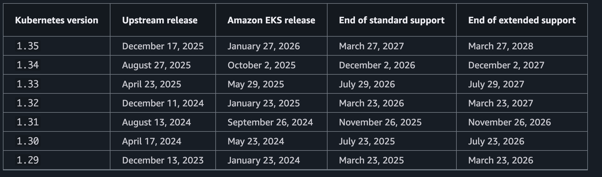

# EKS Upgrade Procedure

## workshop

- [中文升级 workshop](https://catalog.us-east-1.prod.workshops.aws/workshops/2b3af041-8716-4fde-ab3b-408a1036ec7d/zh-CN/30-worker-nodes-upgrade/33-create-new-node-group)
- [[eks-upgrade-lab]]
	- https://eks-upgrades-workshop.netlify.app/
- [Workshop](https://www.eksworkshop.com/intermediate/320_eks_upgrades/) 
- [Accelerate software development lifecycles with GitOps](https://catalog.us-east-1.prod.workshops.aws/workshops/20f7b273-ed55-411f-8c9c-4dc9e5ff8677/en-US)

## 流程 

1: 检查应用配置文件兼容性
- [[../../../../eks-upgrade-insight|eks-upgrade-insight]]
- [[kube-no-trouble]] 
- [[pluto]] 
- [[eksup]] 
- 检查第三方插件 ([[eks-cluster-addons-list]])

2: 升级核心addon （如果集群目标版本和 addon 有兼容问题则先升级 addon，否则在升级完管理节点后再升级 addon）
- coredns: 
	- 托管dns addon ([[managed-coredns]])
	- 自管dns addon ([[self-managed-coredns]])
- aws-node: [[upgrade-vpc-cni]] 
- kube-proxy: [[eks-addons-kube-proxy]]

3: 升级 eks 控制平面

4: 升级 eks 管理节点
- 托管节点的更新 [LINK](https://docs.aws.amazon.com/zh_cn/eks/latest/userguide/update-managed-node-group.html) 
	- [[ssm-document-eks-node-upgrade]] 
- 自管节点的更新 [LINK](https://docs.aws.amazon.com/zh_cn/eks/latest/userguide/update-workers.html) 

5: 升级其他 addons

## others

- [[mm-eks-upgrade-workshop-walkley]]

## deck

### EKS版本升级灵魂三问

#### Q: 为啥要升级？
A: 与上游 Kubernetes 一样，对每个 EKS版本，AWS会对其提供至少 **14个月**的支持。但每个版本End of Life(EOL)后，社区将**停止发布安全补丁**，并**停止接受CVE安全漏洞**提交。运行不安全的Kubernetes集群会为您的数据带来风险，所以我们建议您始终使用受到支持的EKS版本。

#### Q: 不升会怎样？
A: 在End of Support 后，用户将**无法创建**对应版本的EKS集群。EKS 会在支持结束日期后，通过逐步部署流程，**自动更新控制平面到受支持的版本**，数据平面则**保持不变**。为防止自动更新对您工作负载造成影响，建议您在自动升级前**安排手动升级**。

#### Q: 升级难不难？
A: 集群升级的本质是将各个相关组件**替换为期望的新版本**。一般有**原地升级**和**蓝绿部署**两种做法。不论哪种升级，都需要考虑当前安装的组件和资源定义**对新版本的兼容性**，并做好升级计划和演练。由于升级会导致应用重启或**不停机切换**，一个**高度可靠性的架构**是降低升级难度的关键。

## docs history

- for release 1.22 
    - https://github.com/awsdocs/amazon-eks-user-guide/blob/cb60bb7b2b78220f2f8809bbd640ec4d0fbcb5eb/doc_source/kubernetes-versions.md
- for release 1.21 and before
    - https://github.com/awsdocs/amazon-eks-user-guide/blob/a7e7162191efbfdb256ffeb4ec26757c7f3cc7b3/doc_source/kubernetes-versions.md

## refer

- [Amazon EKS 集群升级指南](https://aws.amazon.com/cn/blogs/china/amazon-eks-cluster-upgrade-guide/) 
- [amazon-eks-版本管理策略与升级流程](https://aws.amazon.com/cn/blogs/china/amazon-eks-version-management-strategy-and-upgrade-process/) 
- [Automate Amazon EKS upgrades with infrastructure as code](https://aws.amazon.com/blogs/opensource/automate-amazon-eks-upgrades-with-infrastructure-as-code/) 
- [[GCR Resilience Series - EKS Resilience]]
- https://kubernetes.io/releases/version-skew-policy/

### 参考文档

-   Kubernetes官方文档: [Kubernetes Release Cycle](https://github.com/kubernetes/community/blob/master/contributors/devel/sig-release/release.md)
-   Kubernetes官方文档: [Kubernetes Deprecation Policy](https://kubernetes.io/docs/reference/using-api/deprecation-policy/)
-   Kubernetes博客: [Increasing the Kubernetes Support Window to One Year](https://kubernetes.io/blog/2020/08/31/kubernetes-1-19-feature-one-year-support/)
-   AWS博客: [Planning Kubernetes Upgrades with Amazon EKS](https://aws.amazon.com/blogs/containers/planning-kubernetes-upgrades-with-amazon-eks/)
-   AWS博客: [Making Cluster Updates Easy with Amazon EKS](https://aws.amazon.com/blogs/compute/making-cluster-updates-easy-with-amazon-eks/)
-   AWS官方文档: [Amazon EKS Kubernetes versions](https://docs.aws.amazon.com/eks/latest/userguide/kubernetes-versions.html)
-   AWS官方文档: [Updating a cluster](https://docs.aws.amazon.com/eks/latest/userguide/update-cluster.html)
-   EKS最佳实践手册: [Handling Cluster Upgrades](https://aws.github.io/aws-eks-best-practices/reliability/docs/controlplane/#handling-cluster-upgrades)

