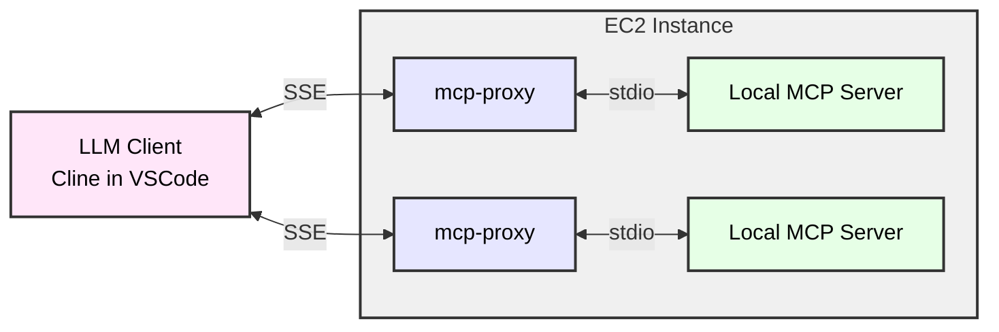

# MCP Server on EC2

```sh
curl -LsSf https://astral.sh/uv/install.sh | sh
uv python install 3.10
```

we will use [mcp-proxy](https://github.com/sparfenyuk/mcp-proxy) to move mcp server to ec2 and let client access mcp server through SSE



- start mcp-proxy 
```sh
nohup mcp-proxy --sse-host=0.0.0.0 --sse-port=8808 uvx mcp-server-fetch 2>&1 1>/tmp/mcp-proxy-8808.log &
nohup mcp-proxy --sse-host=0.0.0.0 --sse-port=8809 --env FASTMCP_LOG_LEVEL ERROR uvx awslabs.aws-documentation-mcp-server@latest 2>&1 1>/tmp/mcp-proxy-8809.log &
nohup mcp-proxy --sse-host=0.0.0.0 --sse-port=8810 --env SEARXNG_URL https://searx.xxx -- docker run -i --rm -e SEARXNG_URL mcp-searxng:latest 2>&1 1>/tmp/mcp-proxy-8810.log &

```

## Use SSE to MCP Server in VSCode Cline

- mcp-server json sample
```json
    "mcp-server-fetch-remote": {
      "autoApprove": [
        "fetch"
      ],
      "disabled": false,
      "timeout": 60,
      "url": "http://xxx:8808/sse",
      "transportType": "sse"
    },
    "awslabs.aws-documentation-mcp-server-remote": {
      "autoApprove": [],
      "disabled": false,
      "timeout": 60,
      "url": "http://xxx:8809/sse",
      "transportType": "sse"
    },
    "searxng-remote": {
      "autoApprove": [
        "searxng_web_search",
        "web_url_read"        
      ],
      "disabled": false,
      "timeout": 60,
      "url": "http://xxx:8810/sse",
      "transportType": "sse"
    },

```

## Use SSE to MCP Server in Dify

- install MCP tools Via SSE plugin in Dify marketplace
![[attachments/build-mcp-server-on-ec2/IMG-build-mcp-server-on-ec2.png|500]]

- Set up authorization
```json
{
  "fetch": {
    "url": "http://xxx:8808/sse",
    "headers": {},
    "timeout": 60,
    "sse_read_timeout": 300
  },
  "aws-docs": {
    "url": "http://xxx:8809/sse",
    "headers": {},
    "timeout": 60,
    "sse_read_timeout": 300
  },
  "searxng": {
    "url": "http://xxx:8810/sse",
    "headers": {},
    "timeout": 60,
    "sse_read_timeout": 300
  }
}
```

- create a new agent in Dify Studio
![[attachments/build-mcp-server-on-ec2/IMG-build-mcp-server-on-ec2-1.png]]


