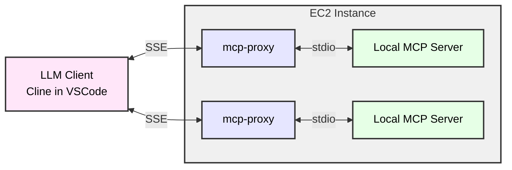

# MCP Server on EC2

## what is mcp-proxy

we move mcp servers to ec2 and use [mcp-proxy](https://github.com/sparfenyuk/mcp-proxy) to convert STDIO to SSE, and let mcp client access mcp server through SSE



当前 amazon Q Dev CLI 只支持 STDIO协议，不支持 SSE，因此在将 mcp server 放到 EC2 上之后，不仅需要将 mcp server 通过 mcp-proxy 暴露成 SSE，在 Q DEV CLI 本地需要通过 mcp-proxy 将远程 SSE，再转换成本地的 STDIO，提供 Q Dev CLI 访问。如下图：

![[attachments/build-mcp-server-on-ec2/IMG-20250515-150819.png|800]]

## 手工部署 -- start mcp server using mcp-proxy 
- use mcp-proxy command directly
```sh
nohup mcp-proxy --sse-host=0.0.0.0 --sse-port=8808 uvx mcp-server-fetch 2>&1 1>/tmp/mcp-proxy-8808.log &
nohup mcp-proxy --sse-host=0.0.0.0 --sse-port=8809 --env FASTMCP_LOG_LEVEL ERROR uvx awslabs.aws-documentation-mcp-server@latest 2>&1 1>/tmp/mcp-proxy-8809.log &
nohup mcp-proxy --sse-host=0.0.0.0 --sse-port=8810 --env SEARXNG_URL https://searx.xxx -- docker run -i --rm -e SEARXNG_URL mcp-searxng:latest 2>&1 1>/tmp/mcp-proxy-8810.log &

```

## 推荐部署 -- put mcp-server in container with mcp-proxy endpoint
- put all files in folder `mymcp`
- use mcp-proxy docker file, run mcp-server in container (minor version provider by mcp-proxy) 
```sh
# git clone https://github.com/sparfenyuk/mcp-proxy
# git clone https://github.com/ihor-sokoliuk/mcp-searxng

cat > mcp-proxy-uv.Dockerfile <<-'EOF'
# file: mcp-proxy-uv.Dockerfile

FROM ghcr.io/sparfenyuk/mcp-proxy:latest

# Install the 'uv' package
RUN python3 -m ensurepip && pip install --no-cache-dir uv

ENV PATH="/usr/local/bin:$PATH" \
    UV_PYTHON_PREFERENCE=only-system

ENTRYPOINT [ "mcp-proxy" ]
EOF
```

- customize mcp-proxy docker file, run mcp-server in container (node version) 
```sh
cat > mcp-proxy-npx.Dockerfile <<-'EOF'
# file: mcp-proxy-npx.Dockerfile
FROM node:20-slim

# Install Python and required packages
RUN apt-get update && apt-get install -y python3 curl \
    && rm -rf /var/lib/apt/lists/*

# Install uv and mcp-proxy using pipx
RUN curl -LsSf https://astral.sh/uv/install.sh | sh
RUN ~/.local/bin/uv python install 3.10
RUN ~/.local/bin/uv tool install mcp-proxy

# Add pipx binaries to PATH
ENV PATH="/root/.local/bin:$PATH" \
    NODE_ENV=production

ENTRYPOINT ["mcp-proxy"]
EOF
```

- customize a general version (ubuntu version)
```sh
cat > mcp-proxy-ubuntu.Dockerfile <<-'EOF'
# file: mcp-proxy-ubuntu.Dockerfile
FROM ubuntu:22.04

# Install Python and required packages
RUN apt-get update && apt-get install -y python3 curl swig git\
    && rm -rf /var/lib/apt/lists/*

# Install uv and mcp-proxy using pipx
RUN curl -LsSf https://astral.sh/uv/install.sh | sh
RUN ~/.local/bin/uv python install 3.10
RUN ~/.local/bin/uv tool install mcp-proxy

# Add pipx binaries to PATH
ENV PATH="/root/.local/bin:$PATH" \
    NODE_ENV=production

ENTRYPOINT ["mcp-proxy"]
EOF
```

- use a docker-compose file to orchestrate
```sh
cat > docker-compose.yaml <<-'EOF'
services:
  fetch-mcp:
    build:
      context: .
      dockerfile: mcp-proxy-uv.Dockerfile
    network_mode: host
    restart: unless-stopped
    ports:
      - 8096:8096
    command: "--pass-environment --port=8096 --sse-host 0.0.0.0 uvx mcp-server-fetch"
  aws-doc-mcp:
    build:
      context: .
      dockerfile: mcp-proxy-uv.Dockerfile
    network_mode: host
    restart: unless-stopped
    ports:
      - 8097:8097
    command: "--pass-environment --port=8097 --sse-host 0.0.0.0 --env FASTMCP_LOG_LEVEL ERROR uvx awslabs.aws-documentation-mcp-server@latest"    
  searxng-mcp:
    build:
      context: .
      dockerfile: mcp-proxy-npx.Dockerfile
    network_mode: host
    restart: unless-stopped
    ports:
      - 8098:8098
    command: "--pass-environment --port=8098 --sse-host 0.0.0.0 --env SEARXNG_URL https://searx -- npx -y mcp-searxng"
EOF

docker compose up -d

```

- add another mcp-server to docker compose file
```yaml
  confluence-mcp:
    build:
      context: .
      dockerfile: mcp-proxy-uv.Dockerfile
    network_mode: host
    restart: unless-stopped
    environment:
      - CONFLUENCE_URL="https://your-company.atlassian.net/wiki"
      - CONFLUENCE_USERNAME="your.email@company.com"
      - CONFLUENCE_API_TOKEN="your_confluence_api_token"
    ports:
      - 8099:8099
    command: "--pass-environment --port=8099 --sse-host 0.0.0.0 -- uvx mcp-atlassian"
```

- git repo research mcp and terraform mcp need ubuntu docker file 
```yaml
  terraform-mcp:
    build:
      context: .
      dockerfile: mcp-proxy-ubuntu.Dockerfile
    network_mode: host
    restart: unless-stopped
    ports:
      - 8815:8815
    command: "--pass-environment --port=8815 --sse-host 0.0.0.0 --env FASTMCP_LOG_LEVEL ERROR --env AWS_REGION us-east-1 uvx awslabs.terraform-mcp-server@latest"

  git-repo-research-mcp:
    build:
      context: .
      dockerfile: mcp-proxy-ubuntu.Dockerfile
    network_mode: host
    restart: unless-stopped
    ports:
      - 8818:8818
    command: "--pass-environment --port=8818 --sse-host 0.0.0.0 --env FASTMCP_LOG_LEVEL ERROR --env AWS_REGION us-east-1 --env GITHUB_TOKEN ghp_xxx uvx awslabs.git-repo-research-mcp-server@latest"

```

- get mcp grafana to folder `mcp-grafana`
```sh
git clone https://github.com/grafana/mcp-grafana.git
```
- add following to `mymcp/docker-compose.yaml`
```yaml
  grafana-mcp:
    build:
      context: ../mcp-grafana
      dockerfile: Dockerfile
    network_mode: host
    restart: unless-stopped
    ports:
      - 8816:8816
    environment:
      - GRAFANA_URL=https://grafana.endpoint
      - GRAFANA_API_KEY=glsa_xxx
    command: "--transport sse --sse-address 0.0.0.0:8816"
```


## Config samples
### Use SSE in VSCode Cline

- mcp-server json sample
```json
    "mcp-server-fetch-remote": {
      "autoApprove": [
        "fetch"
      ],
      "disabled": false,
      "timeout": 60,
      "url": "http://xxx:8808/sse",
      "transportType": "sse"
    },
    "awslabs.aws-documentation-mcp-server-remote": {
      "autoApprove": [],
      "disabled": false,
      "timeout": 60,
      "url": "http://xxx:8809/sse",
      "transportType": "sse"
    },
    "searxng-remote": {
      "autoApprove": [
        "searxng_web_search",
        "web_url_read"        
      ],
      "disabled": false,
      "timeout": 60,
      "url": "http://xxx:8810/sse",
      "transportType": "sse"
    },

```

### Use SSE in Dify

- install MCP tools Via SSE plugin in Dify marketplace
![[attachments/build-mcp-server-on-ec2/IMG-build-mcp-server-on-ec2.png|500]]

- Set up authorization
```json
{
  "fetch": {
    "url": "http://xxx:8808/sse",
    "headers": {},
    "timeout": 60,
    "sse_read_timeout": 300
  },
  "aws-docs": {
    "url": "http://xxx:8809/sse",
    "headers": {},
    "timeout": 60,
    "sse_read_timeout": 300
  },
  "searxng": {
    "url": "http://xxx:8810/sse",
    "headers": {},
    "timeout": 60,
    "sse_read_timeout": 300
  }
}
```

- create a new agent in Dify Studio
![[attachments/build-mcp-server-on-ec2/IMG-build-mcp-server-on-ec2-1.png]]


### In Q Dev CLI
#### install-mcp-proxy-

```sh
curl -LsSf https://astral.sh/uv/install.sh | sh
uv python install 3.10
uv tool install git+https://github.com/sparfenyuk/mcp-proxy

# if you change python version
# uv tool install mcp-proxy --reinstall

```

#### config file: ~/.aws/amazonq/mcp.json

```json
{
  "mcpServers": {
    "fetch-mcp": {
        "command": "mcp-proxy",
        "args": ["httpx://xxx:8808/sse"],
        "env": {}
    }
  }
}
```

