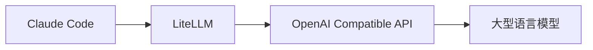
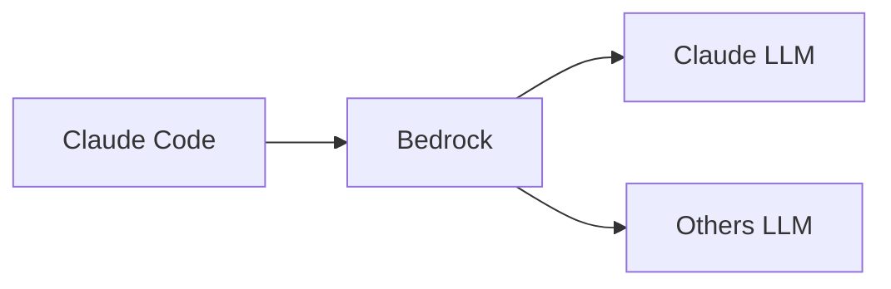

# claude-code

## use litellm directly

从 litellm里调用 openai compatible api 是可以，但是用 cc 调用报错。 怀疑可能是 brc 的问题

```
API Error (500 {"error":{"message":"Error calling litellm.acompletion for non-Anthropic model: litellm.BadRequestError: OpenAIException - Error code: 400 - {'success': False, 'data': 'UnknownError'}","type":"None","param":"None","code":"500"}})
```



https://docs.anthropic.com/en/docs/claude-code/llm-gateway

```bash
export ANTHROPIC_BASE_URL=https://litellm.xxx
export ANTHROPIC_AUTH_TOKEN=sk-xxx
export ANTHROPIC_MODEL="us.anthropic.claude-3-7-sonnet-20250219-v1:0"

claude

```

refer: [[litellm]]

## use claude-code-router

https://github.com/musistudio/claude-code-router/tree/main

only support openrouter, not support litellm


## use directly

https://docs.claude.com/en/docs/claude-code/amazon-bedrock



```bash
# Enable Bedrock integration
export CLAUDE_CODE_USE_BEDROCK=1
export AWS_REGION=us-east-1  # or your preferred region

# Using inference profile ID
# export ANTHROPIC_MODEL='us.deepseek.r1-v1:0'
# export ANTHROPIC_MODEL='deepseek.v3-v1:0'
export ANTHROPIC_MODEL='us.anthropic.claude-3-7-sonnet-20250219-v1:0'
# export ANTHROPIC_SMALL_FAST_MODEL='us.anthropic.claude-3-5-haiku-20241022-v1:0'
# export DISABLE_PROMPT_CACHING=1

# Recommended output token settings for Bedrock
export CLAUDE_CODE_MAX_OUTPUT_TOKENS=4096
export MAX_THINKING_TOKENS=1024

# export AWS_PROFILE=
# export AWS_BEARER_TOKEN_BEDROCK=

claude

```


