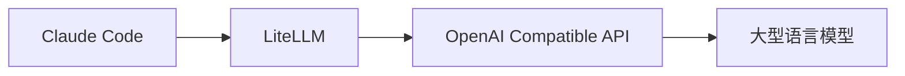

# claude-code



## use litellm directly

https://docs.anthropic.com/en/docs/claude-code/llm-gateway

```
export ANTHROPIC_BASE_URL=https://litellm.xxx
export ANTHROPIC_AUTH_TOKEN=sk-xxx
export ANTHROPIC_MODEL="us.anthropic.claude-3-7-sonnet-20250219-v1:0"

claude

```

refer: [[litellm]]

## use claude-code-router

https://github.com/musistudio/claude-code-router/tree/main

only support openrouter, not support litellm


