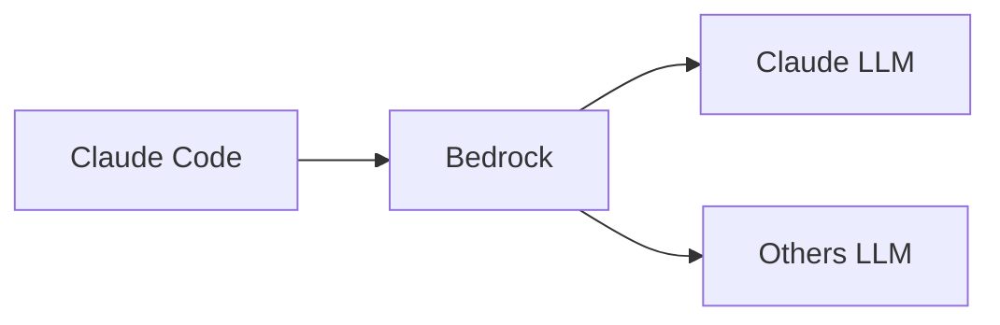

# claude-code

## use litellm directly

https://docs.anthropic.com/en/docs/claude-code/llm-gateway


```bash
export ANTHROPIC_BASE_URL=https://litellm.xxx
export ANTHROPIC_AUTH_TOKEN=sk-xxx
export ANTHROPIC_MODEL="us.anthropic.claude-3-7-sonnet-20250219-v1:0"

claude

```

refer: [[litellm]]

## use bedrock directly

https://docs.claude.com/en/docs/claude-code/amazon-bedrock



```bash
# Enable Bedrock integration
export CLAUDE_CODE_USE_BEDROCK=1
export AWS_REGION=us-east-1  # or your preferred region

# Using inference profile ID
# export ANTHROPIC_MODEL='us.deepseek.r1-v1:0'
# export ANTHROPIC_MODEL='deepseek.v3-v1:0'
export ANTHROPIC_MODEL='us.anthropic.claude-3-7-sonnet-20250219-v1:0'
export ANTHROPIC_SMALL_FAST_MODEL='us.anthropic.claude-3-5-haiku-20241022-v1:0'
# export DISABLE_PROMPT_CACHING=1

# Recommended output token settings for Bedrock
export CLAUDE_CODE_MAX_OUTPUT_TOKENS=4096
export MAX_THINKING_TOKENS=1024

export AWS_PROFILE=
# export AWS_BEARER_TOKEN_BEDROCK=

# work around when you in the countries which anthropics does not support 

claude

```

## use claude-code-router

https://github.com/musistudio/claude-code-router/tree/main

only support openrouter, not support litellm

## UI

聊天界面抖动不方便查看 AI 响应，另外模型只从 UI 上获取，无法从环境变量中获取
- https://github.com/winfunc/opcode


## install claude code

```sh
npm install -g @anthropic-ai/claude-code
```


## feature: agent skills

build skills
- https://github.com/yusufkaraaslan/Skill_Seekers

agent skills mcp
- https://builder.aws.com/content/34NW7Wl1gpOl2E4jeJQ6iytovSM/how-to-use-agent-skills-with-amazon-q-developer-and-kiro
    - https://github.com/DiscreteTom/agent-skills-mcp

anthropoics skills
- https://github.com/anthropics/skills


