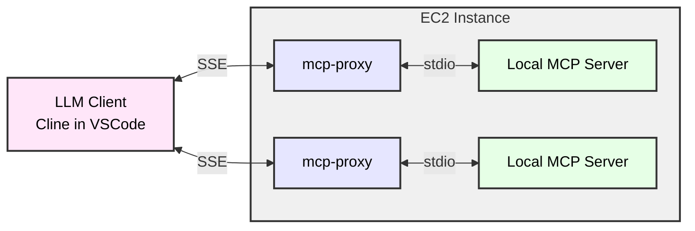

# SearxNG MCP Server for Cline

## Build your own SearxNG

- Install docker & docker-compose on your linux
- Clone https://github.com/searxng/searxng-docker
- Edit .env
```
SEARXNG_HOSTNAME=www.hostname.domainname
LETSENCRYPT_EMAIL=mailbox@example.com
```
- Edit [searxng/settings.yml](https://github.com/searxng/searxng-docker/blob/master/searxng/settings.yml) 
```
# see https://docs.searxng.org/admin/settings/settings.html#settings-use-default-settings
use_default_settings: true
server:
  # base_url is defined in the SEARXNG_BASE_URL environment variable, see .env and docker-compose.yml
  secret_key: "xxxx"  # change this!
  limiter: false  # can be disabled for a private instance
  image_proxy: true
ui:
  static_use_hash: true
redis:
  url: redis://redis:6379/0
search:
  # remove format to deny access, use lower case.
  # formats: [html, csv, json, rss]
  formats:
    - html
    - json # <-- MCP need this format
```
- First time to start containers, need change docker-compose.yaml
```
searxng:
  ...
  # cap_drop:
  #   - ALL
  ...
```
- Start docker for searxng, caddy, redis, etc.
```
docker-compose up -d
```
- Add A record in route53 to point the public ip of EC2
    - Open 80, 443 port for this EC2
- Access your www.hostname.domainname

![[attachments/searxng-mcp-server-for-cline/IMG-searxng-mcp-server-for-cline.png]]


## MCP for SearxNG
- you need node 20/22 on you laptop ([[../CLI/linux/nodejs-cmd|nodejs-cmd]])
- clone https://github.com/ihor-sokoliuk/mcp-searxng
- build it
```sh
npm run build
ls ./dist/index.js

```
- MCP settings in Cline
```json
{
  "mcpServers": {
    "searxng": {
      "timeout": 60,
      "command": "node",
      "args": [
        "/full/path/to/dist/index.js"
      ],
      "env": {
        "SEARXNG_URL": "https://www.hostname.domainname"
      },
      "transportType": "stdio"
    }
  }
}
```


## MCP Server on EC2

```sh
curl -LsSf https://astral.sh/uv/install.sh | sh
uv python install 3.10
```

we will use [mcp-proxy](https://github.com/sparfenyuk/mcp-proxy) to move mcp server to ec2 and let client access mcp server through SSE



- start mcp-proxy 
```sh
nohup mcp-proxy --sse-host=0.0.0.0 --sse-port=8808 uvx mcp-server-fetch 2>&1 1>/tmp/mcp-proxy-8808.log &
nohup mcp-proxy --sse-host=0.0.0.0 --sse-port=8809 --env FASTMCP_LOG_LEVEL ERROR uvx awslabs.aws-documentation-mcp-server@latest 2>&1 1>/tmp/mcp-proxy-8809.log &
nohup mcp-proxy --sse-host=0.0.0.0 --sse-port=8810 --env SEARXNG_URL https://searx.xxx -- docker run -i --rm -e SEARXNG_URL mcp-searxng:latest 2>&1 1>/tmp/mcp-proxy-8810.log &

```

## Use SSE MCP Server in VSCode Cline

- mcp-server json sample
```json
    "mcp-server-fetch-remote": {
      "autoApprove": [
        "fetch"
      ],
      "disabled": false,
      "timeout": 60,
      "url": "http://xxx:8808/sse",
      "transportType": "sse"
    },
    "awslabs.aws-documentation-mcp-server-remote": {
      "autoApprove": [],
      "disabled": false,
      "timeout": 60,
      "url": "http://xxx:8809/sse",
      "transportType": "sse"
    },
    "searxng-remote": {
      "autoApprove": [
        "searxng_web_search",
        "web_url_read"        
      ],
      "disabled": false,
      "timeout": 60,
      "url": "http://xxx:8810/sse",
      "transportType": "sse"
    },

```

## Use SSE MCP Server in Dify

- install MCP tools Via SSE plugin in Dify marketplace
![[attachments/searxng-mcp-server-for-cline/IMG-searxng-mcp-server-for-cline-9.png|500]]

- Set up authorization
```json
{
  "fetch": {
    "url": "http://xxx:8808/sse",
    "headers": {},
    "timeout": 60,
    "sse_read_timeout": 300
  },
  "aws-docs": {
    "url": "http://xxx:8809/sse",
    "headers": {},
    "timeout": 60,
    "sse_read_timeout": 300
  },
  "searxng": {
    "url": "http://xxx:8810/sse",
    "headers": {},
    "timeout": 60,
    "sse_read_timeout": 300
  }
}
```

- create a new agent in Dify Studio
![[attachments/searxng-mcp-server-for-cline/IMG-searxng-mcp-server-for-cline-8.png]]


## Refer
https://docs.searxng.org/admin/installation-searxng.html#configuration

### what is mcp

![[attachments/searxng-mcp-server-for-cline/IMG-searxng-mcp-server-for-cline-6.png]]

![[attachments/searxng-mcp-server-for-cline/IMG-searxng-mcp-server-for-cline-5.png]]

![[attachments/searxng-mcp-server-for-cline/IMG-searxng-mcp-server-for-cline-1.png]]

![[attachments/searxng-mcp-server-for-cline/IMG-searxng-mcp-server-for-cline-4.png]]

### compare to traditional

![[attachments/searxng-mcp-server-for-cline/IMG-searxng-mcp-server-for-cline-2.png]]

### workflow

![[attachments/searxng-mcp-server-for-cline/IMG-searxng-mcp-server-for-cline-3.png]]

### another sample
```json
{
  "mcpServers": {
    "searxng": {
      "timeout": 60,
      "command": "uvx",
      "args": [
        "mcp-searxng"
      ],
      "env": {
        "SEARXNG_URL": "https://www.hostname.domainname"
      },
      "transportType": "stdio"
    }
  }
}
```


### blog
https://aws.amazon.com/blogs/machine-learning/harness-the-power-of-mcp-servers-with-amazon-bedrock-agents/


