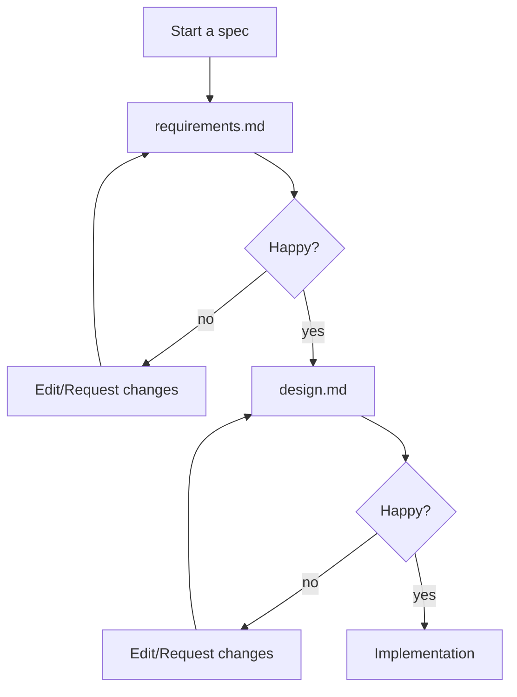

# vibe-vs-spec

## 何时使用Vibe

- 互动问答形式：Vibe会话针对代码相关的来回对话进行了优化，让你可以提问并获得即时回应。
- 快速帮助：它们非常适合获取编程问题的快速解答、代码行为解释，或在不经过正式规范流程的情况下理解概念。
- 上下文理解：与其他Kiro会话一样，Vibe会话利用上下文提供者来理解你的代码库，但更注重解释而非大量代码生成。
- 灵活方法：与Spec会话相比，Vibe会话提供更流畅、结构性更低的方法，使其适合探索性编码和学习。

## 何时使用Spec

- 复杂开发任务：使用Spec会话来构建复杂功能、整个应用程序或需要仔细规划和执行的重大重构。
- 结构化方法：当你需要一种有条理的、循序渐进的开发方法，并对需求和实现细节进行清晰记录时。
- 团队协作：适用于多个团队成员需要理解实施计划并根据规范跟踪进度的项目。
- 文档需求：当你希望在代码实现的同时生成详细文档，以便将来参考或知识共享时。

## mermaid

