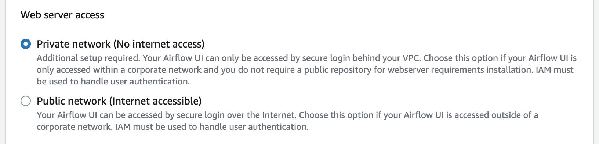

# mwaa-lab

## prepare-endpoint-for-your-private-network-

中国区 mwaa 服务刚上线，由于文档还未按照中国区特殊性进行描述，因此会导致客户疑惑（文档链接[link](https://docs.amazonaws.cn/en_us/mwaa/latest/userguide/vpc-create.html#vpc-create-template-private-only)）。本文提供两种方式可以满足创建 mwaa 的网络条件

### 命令行

从本地命令行对于目标 vpc 进行定制，首先确保你有安装最新版本 awscli，另外，需要有 credential 配置在命令行

```sh
VPC_ID=vpc-0ab3bxxxx
PRIV_SUBNET_STRING="subnet-0b314xxx1 subnet-0bddxxxf61"

export AWS_PAGER=""
export AWS_REGION=cn-northwest-1
export AWS_DEFAULT_REGION=${AWS_REGION}
export AWS_PROFILE=panlmcn

ROUTE_TABLE_STRING=$(for i in ${PRIV_SUBNET_STRING}; do
aws ec2 describe-route-tables \
--filter Name=association.subnet-id,Values=$i \
--query RouteTables[].RouteTableId \
--output text
done |sort -u |xargs)

# create security group
SECURITY_GROUP_NAME=mwaa-endp-$RANDOM
SECURITY_GROUP_ID=$(aws ec2 create-security-group \
  --description ${SECURITY_GROUP_NAME} \
  --group-name ${SECURITY_GROUP_NAME} \
  --vpc-id ${VPC_ID} \
  --query 'GroupId' --output text )
# self traffic allowed
aws ec2 authorize-security-group-ingress \
  --group-id ${SECURITY_GROUP_ID} \
  --protocol -1 \
  --port -1 \
  --source-group ${SECURITY_GROUP_ID}

# china region endpoint services needed by mwaa in private env
CN_SERVICE_LIST="
cn.com.amazonaws.${AWS_REGION}.monitoring
cn.com.amazonaws.${AWS_REGION}.ecr.dkr
cn.com.amazonaws.${AWS_REGION}.ecr.api
com.amazonaws.${AWS_REGION}.logs
cn.com.amazonaws.${AWS_REGION}.sqs
com.amazonaws.${AWS_REGION}.kms
cn.com.amazonaws.${AWS_REGION}.airflow.api	
cn.com.amazonaws.${AWS_REGION}.airflow.env	
"

# global region endpoint services needed by mwaa in private env
SERVICE_LIST="
com.amazonaws.${AWS_REGION}.monitoring
com.amazonaws.${AWS_REGION}.ecr.dkr
com.amazonaws.${AWS_REGION}.ecr.api
com.amazonaws.${AWS_REGION}.logs
com.amazonaws.${AWS_REGION}.sqs
com.amazonaws.${AWS_REGION}.kms
com.amazonaws.${AWS_REGION}.airflow.api
com.amazonaws.${AWS_REGION}.airflow.env
com.amazonaws.${AWS_REGION}.airflow.ops
"

echo ${AWS_REGION} |egrep -q '^cn-'
if [[ $? -eq 0 ]]; then
    SERVICE_LIST=${CN_SERVICE_LIST}
fi

# create interface endpoint
for i in ${SERVICE_LIST}; do
aws ec2 create-vpc-endpoint \
    --vpc-id ${VPC_ID} \
    --vpc-endpoint-type Interface \
    --service-name $i \
    --subnet-id ${PRIV_SUBNET_STRING} \
    --security-group-id ${SECURITY_GROUP_ID}
done

envsubst >s3-gw-endpoint-policy.json <<-EOF
{
  "Statement": [
    {
      "Principal": "*",
      "Action": "*",
      "Effect": "Allow",
      "Resource": "*"
    }
  ]
}
EOF

# create s3 gateway endpoint
aws ec2 create-vpc-endpoint --vpc-id ${VPC_ID} \
--service-name com.amazonaws.${AWS_REGION}.s3 \
--route-table-ids ${ROUTE_TABLE_STRING} \
--vpc-endpoint-type Gateway \
--policy-document file://s3-gw-endpoint-policy.json

```

### cloudformation 模版

- 使用这个模版（[download](mwaa-private-vpc.yaml)）创建专用于 mwaa 的 vpc 环境


## create mwaa environment

- 选择之前命令行中指定的 vpc 和 子网


- 使用私有网络暴露 web 服务器，后续可以通过 ssh tunnel 或者 ssm tunnel 方式远程访问


- 同时选择 “创建新安全组” 和 “之前命令行创建的安全组（用于 interface endpoint）”


