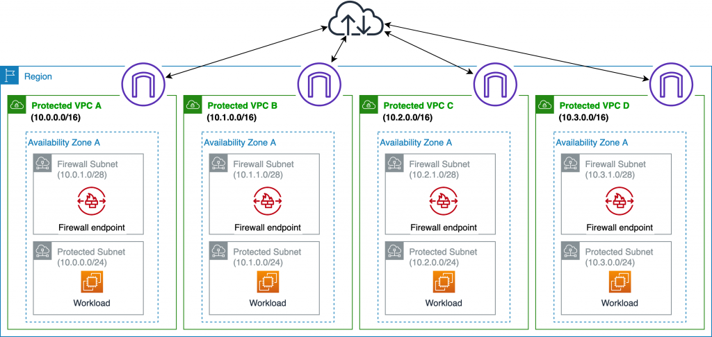
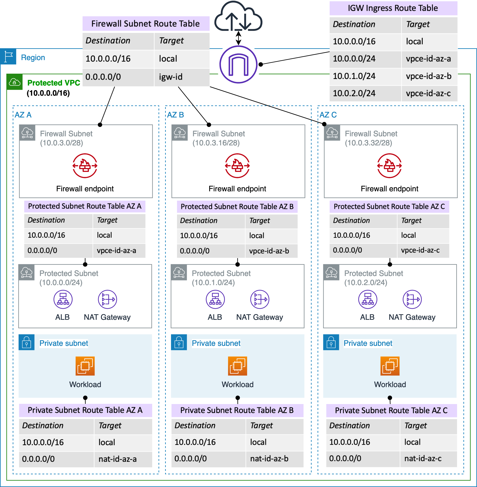
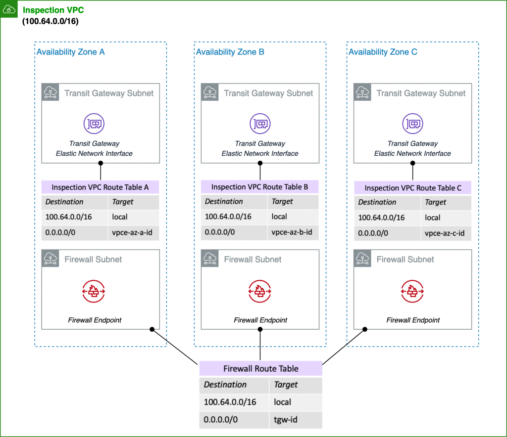

# Deployment models for AWS Network Firewall with VPC routing enhancements

https://aws.amazon.com/blogs/networking-and-content-delivery/deployment-models-for-aws-network-firewall-with-vpc-routing-enhancements/

# Deployment models for AWS Network Firewall

https://aws.amazon.com/blogs/networking-and-content-delivery/deployment-models-for-aws-network-firewall/

## Distributed AWS Network Firewall deployment model

AWS Network Firewall is deployed into each individual VPC.

## Centralized AWS Network Firewall deployment model

AWS Network Firewall is deployed into centralized VPC for East-West (VPC-to-VPC) and/or North-South (internet egress and ingress, on-premises) traffic. We refer to this VPC as inspection VPC throughout this blog post.

## Combined AWS Network Firewall deployment model

AWS Network Firewall is deployed into centralized inspection VPC for East-West (VPC-to-VPC) and subset of North-South (On Premises/Egress) traffic. Internet ingress is distributed to VPCs which require dedicated inbound access from the internet and AWS Network Firewall is deployed accordingly.

# Deploy centralized traffic filtering using AWS Network Firewall

https://aws.amazon.com/blogs/networking-and-content-delivery/deploy-centralized-traffic-filtering-using-aws-network-firewall/

https://aws.amazon.com/solutions/implementations/aws-network-firewall-deployment-automations-for-aws-transit-gateway/

