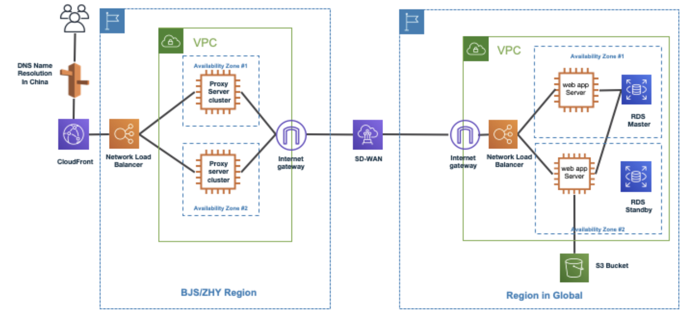

> [!WARNING] This is a github note
# Cross Region Reverse Proxy with NLB and Cloudfront
## diagram
- original region in global on right hand side
- china region on left hand side


## prepare application on eks
### host zone
- 2 host zones, one for each region
```sh
DOMAIN_NAME=poc1009.aws.panlm.xyz # for original region 
AWS_REGION=us-east-2 # for original region
CN_DOMAIN_NAME=poc1010.aws.panlm.xyz # for china region
```

??? note "right-click & open-in-new-tab: "
    ![[../EKS/addons/externaldns-for-route53#func-setup-hosted-zone-]]

### eks cluster
- create eks cluster (refer: [[../CLI/linux/eksdemo#create eks cluster-]])
- install addons (refer: [[../CLI/linux/eksdemo#addons-]])
    - externaldns
    - aws load balancer controller
    - certificate
- httpbin app

### httpbin
- [[TC-private-apigw-dataflow#后端应用]] ([github](https://github.com/panlm/blog-private-api-gateway-dataflow/blob/main/TC-private-apigw-dataflow.md#%E5%90%8E%E7%AB%AF%E5%BA%94%E7%94%A8))
- ingress setting with multiple certificates and host wildcard
```yaml
metadata:
  annotations:
    alb.ingress.kubernetes.io/certificate-arn: arn_cert1,arn_cert2
spec:
  ingressClassName: alb
  rules:
    - host: '*.${DOMAIN_NAME#*.}' # match DOMAIN_NAME and CN_DOMAIN_NAME
```
- ensure `*.domain_name` existed in *both* host zones, any domains could access to ALB directly, for example `httpbin.${DOMAIN_NAME}`
```sh
curl https://httpbin.${DOMAIN_NAME}/anything
```


## prep NLB-1 in front of ALB
- ALB type target group to tcp 80/443 (ALB 类型 TG 只能选 TCP，没有 TLS)
- create NLB-1 with 2 listeners, 80/443 (TCP only, no TLS)
- on route53, add DNS record alias to NLB-1, called `nlbtoalb.${DOMAIN_NAME}`
```sh
curl https://nlbtoalb.${DOMAIN_NAME}/anything
curl -L http://nlbtoalb.${DOMAIN_NAME}/anything
```
- both could access application successfully

## reverse proxy in china region-
- setup 2 EC2 instances [[fake-waf-on-ec2-forwarding-https#Layer 4 forwarding with iptables]] ([github](https://github.com/panlm/blog-private-api-gateway-dataflow/blob/main/fake-waf-on-ec2-forwarding-https.md#layer-4-forwarding-with-iptables))
- forward request to NLB-1's public IP addresses. 
    - We have 2 destination IPs, using probability 50% in first rule and keep 2nd rule always been hit.
    - If your have 3 destination IPs, using 0.33/0.5 in first 2 rules and keep last one always been hit.
```sh
instance_ip=172.31.17.223 # instance internal ip address
next_ip=3.115.136.123 # one ip address of vpce domain name
next_ip2=3.241.89.18

# get alb/nlb internal ip addresses
for i in 172.31.20.112 172.31.33.21; do
    iptables -t nat -A PREROUTING -p tcp -s $i -d $instance_ip --dport 443 \
        -m statistic --mode random --probability 0.5 \
        -i eth0 -j DNAT --to-destination $next_ip:443;
    iptables -t nat -A PREROUTING -p tcp -s $i -d $instance_ip --dport 443 \
        -i eth0 -j DNAT --to-destination $next_ip2:443;
done

iptables -t nat -A POSTROUTING -p tcp --dport 443 -s 172.31.0.0/16 -d $next_ip -o eth0 -j MASQUERADE;

```

- NLB-2 in front of these EC2 instances
- on route53, add dedicate host zone for this region and add DNS record CNAME to NLB-2, called `test.${CN_DOMAIN_NAME}`
- 请求将获取到 reverse proxy 公网地址
```sh
curl https://test.${CN_DOMAIN_NAME}/ip
```

## cloudfront in front of NLB-2
- create certificate for cn domain name for cloudfront
    - 如果不使用 cloudfront 则不需要创建证书
- create origin to NLB-2 
    - using aws default domain name 
    - or NLB-2's domain name (`test.${CN_DOMAIN_NAME}`)
- create route53, add DNS record CNAME to cloudfront, called `abc.${CN_DOMAIN_NAME}`
```sh
curl https://abc.${CN_DOMAIN_NAME}/ip
```


- no CORS needed

## more
- iptables DNAT will exhaust ports or not ?
    - No. refer [link](https://www.frozentux.net/iptables-tutorial/cn/iptables-tutorial-cn-1.1.19.html#TRAVERSINGOFTABLES)

### refer
- [[../CLI/linux/iptables]]
- [[fake-waf-on-ec2-forwarding-https]]
    - [github](https://github.com/panlm/blog-private-api-gateway-dataflow/blob/main/fake-waf-on-ec2-forwarding-https.md) 
- using alb + nginx as reverse proxy 
    - [[Extend Your Web Application Deployment to the China Region Using AWS Direct Connect]]
- https://scalingo.com/blog/iptables

