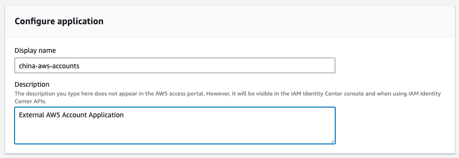

> [!WARNING] This is a github note

# Using Global SSO to Login China AWS Accounts
## go through
### use identity center directory as identity source
- create application `External AWS Account Application` from sso `Applications`

- download `IAM Identity Center SAML metadata file` 

- create identity provider in aws china account


- create role for `SAML 2.0 federation` in aws china account, and assign policy to it


- back to create application page, review application metadata
    - using `https://signin.amazonaws.cn/saml`
    - ~~original is `https://signin.aws.amazon.com/saml`~~


- create application
- edit `attribute mappings` for this application, ensure following two field existed

| Field                                                  | Value                                                                                                      | Format      |
| ------------------------------------------------------ | ---------------------------------------------------------------------------------------------------------- | ----------- |
| `https://aws.amazon.com/SAML/Attributes/Role`            | arn:aws:iam::**ACCOUNTID**:saml-provider/**SAMLPROVIDERNAME**,arn:aws:iam::**ACCOUNTID**:role/**ROLENAME** | unspecified |
| `https://aws.amazon.com/SAML/Attributes/RoleSessionName` | <ROLE_SESSION_NAME> must match [a-zA-Z_0-9+=,.@-]{2,64}                                                    | unspecified |

![[../git-attachment/global-sso-and-china-aws-accounts-png-5.png]]

- assign user to application and login
    - find login url from sso dashboard or reset user's password


### use managed AD as identity source
- configure attribute mapping in `manage sync` in `settings`
![[../git-attachment/global-sso-and-china-aws-accounts-png-7.png]]

- others steps are same 

### use external IdP as identity source
- todo


### in same organization user and role
- in multi-account permissions, choose account, and assign user/group to it, assign permission set to it.
- assume from CLI
```sh
assume 
assume --sso --sso-start-url https://xxx.awsapps.com/start \
    --sso-region ap-southeast-1 \
    --account-id xxx \
    --role-name AWSAdministratorAccess \
    --verbose
```

## refer
- https://static.global.sso.amazonaws.com/app-4a24b6fe5e450fa2/instructions/index.htm
- https://aws.amazon.com/cn/blogs/china/use-amazon-cloud-technology-single-sign-on-service-for-amazon-cloud-technology-china/
- https://static.global.sso.amazonaws.com/app-4a24b6fe5e450fa2/instructions/index.htm


