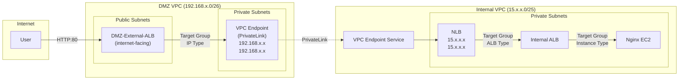
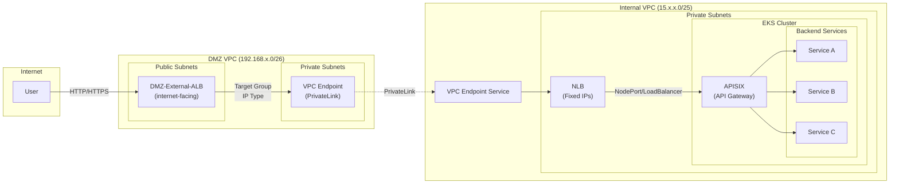

# 解决 Target Group 中添加内部服务 IP 时遇到 Unsupported IP 的错误

## 背景与挑战

客户需要将位于内部 VPC 的服务通过 DMZ VPC 暴露给外部用户访问。当尝试在 DMZ ALB 的 Target Group 中添加内部服务 IP 时，遇到 **"Unsupported IP"** 错误。

**问题原因**：ALB Target Group (IP 类型) 只支持以下地址范围：

| 地址范围 | 类型 |
|---------|------|
| `10.0.0.0/8` | RFC1918 私有地址 |
| `172.16.0.0/12` | RFC1918 私有地址 |
| `192.168.0.0/16` | RFC1918 私有地址 |
| `100.64.0.0/10` | RFC6598 CGNAT 地址 |

而客户内部 VPC 使用非标准私有地址段（如 `15.x.x.x`），不在上述允许范围内，因此无法直接注册为 ALB 目标。

### 主要挑战

1. 内部 VPC 使用非 RFC1918 地址段，ALB 无法直接将其作为目标
2. AWS WAF 只能与 ALB 相关联

## 解决方案

采用 **AWS PrivateLink** 实现跨 VPC 的安全流量转发：

### 核心组件

| 组件 | 位置 | 作用 |
|------|------|------|
| External ALB | DMZ VPC (Public Subnet) | 接收外部流量 |
| VPC Endpoint | DMZ VPC (Private Subnet) | 提供 RFC1918 固定 IP |
| VPC Endpoint Service | Internal VPC | 暴露 NLB 服务 |
| NLB | Internal VPC | 提供固定 IP，转发到 ALB |
| Internal ALB | Internal VPC | 负载均衡到后端服务 |

### 流量链路

```
User → DMZ-External-ALB → VPC Endpoint (PrivateLink) → VPC Endpoint Service → NLB → Internal ALB → Backend
```

### 方案优势

1. **固定 IP**：VPC Endpoint 在 DMZ VPC 中提供 RFC1918 地址，可作为 ALB Target Group 目标
2. **无需 VPC Peering**：PrivateLink 通过 AWS 内部网络传输，独立于 VPC Peering
3. **安全隔离**：流量不经过公网，服务提供方可控制访问权限

### 架构图

- 我的测试环境：ALB + EC2 后端



- 客户实际场景是：NLB + EKS (APISIX) 后端



### 其他解决方案

- 可以使用第三方 waf，这样可以避免内网地址不符合 RFC1918 要求的问题（[../../git-attachment/blog-design-your-firewall-deployment-for-internet-ingress-traffic-flows](../../git-attachment/blog-design-your-firewall-deployment-for-internet-ingress-traffic-flows.md)）
- open ticket, aws support could help to add YOUR CIDR to white list to work around.


## 资源清单

### DMZ VPC

| 资源 | 说明 |
|------|------|
| VPC | CIDR: 192.168.x.0/26 |
| Public Subnet 1 | 192.168.x.0/28, AZ-a |
| Public Subnet 2 | 192.168.x.16/28, AZ-b |
| Private Subnet 1 | 192.168.x.32/28, AZ-a |
| Private Subnet 2 | 192.168.x.48/28, AZ-b |
| Internet Gateway | 用于 Public Subnet 出网 |
| NAT Gateway | 用于 Private Subnet 出网 |
| External ALB | internet-facing，位于 Public Subnet |
| VPC Endpoint | Interface 类型，位于 Private Subnet，提供 RFC1918 固定 IP |

### Internal VPC (WuKong Boss Foundation)

| 资源 | 说明 |
|------|------|
| VPC | CIDR: 15.x.x.0/25 (非 RFC1918) |
| Private Subnet 1 | 15.x.x.0/26, AZ-a |
| Private Subnet 2 | 15.x.x.64/26, AZ-b |
| Backend EC2/EKS | 运行实际业务服务 |
| Internal ALB | internal，负载均衡到后端 |
| NLB | internal，提供固定 IP |
| VPC Endpoint Service | 关联 NLB，暴露服务 |

## 测试验证

```bash
# 访问外部 ALB
curl http://<EXTERNAL_ALB_DNS>

# 预期输出
<h1>Welcome to Backend Service</h1>
```

## 注意事项

1. **NLB 是必须的**：VPC Endpoint Service 只能关联 NLB 或 GWLB，不能直接关联 ALB
2. **NLB 支持 ALB 类型 Target Group**：可直接将 ALB ARN 注册为目标，无需手动维护 ALB 的 IP 地址
3. **健康检查**：确保各层安全组允许健康检查流量
4. **成本考虑**：PrivateLink 按数据处理量和端点小时数计费
5. **跨账户支持**：VPC Endpoint Service 可以跨账户共享服务

---

## 附录：操作命令

### A. 创建 DMZ VPC

```bash
export AWS_PROFILE=<your-profile>
export AWS_DEFAULT_REGION=us-west-2

# ========== 网络 CIDR 配置 (根据实际情况修改) ==========
DMZ_VPC_CIDR="192.168.x.0/26"
DMZ_PUBLIC_SUBNET_1_CIDR="192.168.x.0/28"
DMZ_PUBLIC_SUBNET_2_CIDR="192.168.x.16/28"
DMZ_PRIVATE_SUBNET_1_CIDR="192.168.x.32/28"
DMZ_PRIVATE_SUBNET_2_CIDR="192.168.x.48/28"
AZ_1="us-west-2a"
AZ_2="us-west-2b"
# ======================================================

# 创建 VPC
DMZ_VPC_ID=$(aws ec2 create-vpc \
  --cidr-block $DMZ_VPC_CIDR \
  --tag-specifications 'ResourceType=vpc,Tags=[{Key=Name,Value=DMZ-VPC}]' \
  --query 'Vpc.VpcId' --output text)

# 启用 DNS
aws ec2 modify-vpc-attribute --vpc-id $DMZ_VPC_ID --enable-dns-hostnames '{"Value":true}'
aws ec2 modify-vpc-attribute --vpc-id $DMZ_VPC_ID --enable-dns-support '{"Value":true}'

# 创建子网
DMZ_PUBLIC_SUBNET_1=$(aws ec2 create-subnet --vpc-id $DMZ_VPC_ID --cidr-block $DMZ_PUBLIC_SUBNET_1_CIDR --availability-zone $AZ_1 --tag-specifications 'ResourceType=subnet,Tags=[{Key=Name,Value=DMZ-Public-Subnet-1}]' --query 'Subnet.SubnetId' --output text)
DMZ_PUBLIC_SUBNET_2=$(aws ec2 create-subnet --vpc-id $DMZ_VPC_ID --cidr-block $DMZ_PUBLIC_SUBNET_2_CIDR --availability-zone $AZ_2 --tag-specifications 'ResourceType=subnet,Tags=[{Key=Name,Value=DMZ-Public-Subnet-2}]' --query 'Subnet.SubnetId' --output text)
DMZ_PRIVATE_SUBNET_1=$(aws ec2 create-subnet --vpc-id $DMZ_VPC_ID --cidr-block $DMZ_PRIVATE_SUBNET_1_CIDR --availability-zone $AZ_1 --tag-specifications 'ResourceType=subnet,Tags=[{Key=Name,Value=DMZ-Private-Subnet-1}]' --query 'Subnet.SubnetId' --output text)
DMZ_PRIVATE_SUBNET_2=$(aws ec2 create-subnet --vpc-id $DMZ_VPC_ID --cidr-block $DMZ_PRIVATE_SUBNET_2_CIDR --availability-zone $AZ_2 --tag-specifications 'ResourceType=subnet,Tags=[{Key=Name,Value=DMZ-Private-Subnet-2}]' --query 'Subnet.SubnetId' --output text)

# 创建 IGW
DMZ_IGW=$(aws ec2 create-internet-gateway --tag-specifications 'ResourceType=internet-gateway,Tags=[{Key=Name,Value=DMZ-IGW}]' --query 'InternetGateway.InternetGatewayId' --output text)
aws ec2 attach-internet-gateway --internet-gateway-id $DMZ_IGW --vpc-id $DMZ_VPC_ID

# 启用 Public Subnet 自动分配公网 IP
aws ec2 modify-subnet-attribute --subnet-id $DMZ_PUBLIC_SUBNET_1 --map-public-ip-on-launch
aws ec2 modify-subnet-attribute --subnet-id $DMZ_PUBLIC_SUBNET_2 --map-public-ip-on-launch

# 创建 NAT Gateway
DMZ_EIP=$(aws ec2 allocate-address --domain vpc --query 'AllocationId' --output text)
DMZ_NAT=$(aws ec2 create-nat-gateway --subnet-id $DMZ_PUBLIC_SUBNET_1 --allocation-id $DMZ_EIP --tag-specifications 'ResourceType=natgateway,Tags=[{Key=Name,Value=DMZ-NAT}]' --query 'NatGateway.NatGatewayId' --output text)

# 创建路由表
DMZ_PUBLIC_RT=$(aws ec2 create-route-table --vpc-id $DMZ_VPC_ID --tag-specifications 'ResourceType=route-table,Tags=[{Key=Name,Value=DMZ-Public-RT}]' --query 'RouteTable.RouteTableId' --output text)
aws ec2 create-route --route-table-id $DMZ_PUBLIC_RT --destination-cidr-block 0.0.0.0/0 --gateway-id $DMZ_IGW
aws ec2 associate-route-table --route-table-id $DMZ_PUBLIC_RT --subnet-id $DMZ_PUBLIC_SUBNET_1
aws ec2 associate-route-table --route-table-id $DMZ_PUBLIC_RT --subnet-id $DMZ_PUBLIC_SUBNET_2

# 等待 NAT Gateway 可用
aws ec2 wait nat-gateway-available --nat-gateway-ids $DMZ_NAT

DMZ_PRIVATE_RT=$(aws ec2 create-route-table --vpc-id $DMZ_VPC_ID --tag-specifications 'ResourceType=route-table,Tags=[{Key=Name,Value=DMZ-Private-RT}]' --query 'RouteTable.RouteTableId' --output text)
aws ec2 create-route --route-table-id $DMZ_PRIVATE_RT --destination-cidr-block 0.0.0.0/0 --nat-gateway-id $DMZ_NAT
aws ec2 associate-route-table --route-table-id $DMZ_PRIVATE_RT --subnet-id $DMZ_PRIVATE_SUBNET_1
aws ec2 associate-route-table --route-table-id $DMZ_PRIVATE_RT --subnet-id $DMZ_PRIVATE_SUBNET_2
```

### B. 创建 Internal VPC

```bash
# ========== 网络 CIDR 配置 (根据实际情况修改) ==========
INTERNAL_VPC_CIDR="15.x.x.0/25"
INTERNAL_PRIVATE_SUBNET_1_CIDR="15.x.x.0/26"
INTERNAL_PRIVATE_SUBNET_2_CIDR="15.x.x.64/26"
# ======================================================

# 创建 VPC (使用非 RFC1918 地址段)
INTERNAL_VPC_ID=$(aws ec2 create-vpc \
  --cidr-block $INTERNAL_VPC_CIDR \
  --tag-specifications 'ResourceType=vpc,Tags=[{Key=Name,Value=Internal-VPC}]' \
  --query 'Vpc.VpcId' --output text)

aws ec2 modify-vpc-attribute --vpc-id $INTERNAL_VPC_ID --enable-dns-hostnames '{"Value":true}'
aws ec2 modify-vpc-attribute --vpc-id $INTERNAL_VPC_ID --enable-dns-support '{"Value":true}'

# 创建子网
INTERNAL_PRIVATE_SUBNET_1=$(aws ec2 create-subnet --vpc-id $INTERNAL_VPC_ID --cidr-block $INTERNAL_PRIVATE_SUBNET_1_CIDR --availability-zone $AZ_1 --tag-specifications 'ResourceType=subnet,Tags=[{Key=Name,Value=Internal-Private-Subnet-1}]' --query 'Subnet.SubnetId' --output text)
INTERNAL_PRIVATE_SUBNET_2=$(aws ec2 create-subnet --vpc-id $INTERNAL_VPC_ID --cidr-block $INTERNAL_PRIVATE_SUBNET_2_CIDR --availability-zone $AZ_2 --tag-specifications 'ResourceType=subnet,Tags=[{Key=Name,Value=Internal-Private-Subnet-2}]' --query 'Subnet.SubnetId' --output text)

# 创建路由表
INTERNAL_PRIVATE_RT=$(aws ec2 create-route-table --vpc-id $INTERNAL_VPC_ID --tag-specifications 'ResourceType=route-table,Tags=[{Key=Name,Value=Internal-Private-RT}]' --query 'RouteTable.RouteTableId' --output text)
aws ec2 associate-route-table --route-table-id $INTERNAL_PRIVATE_RT --subnet-id $INTERNAL_PRIVATE_SUBNET_1
aws ec2 associate-route-table --route-table-id $INTERNAL_PRIVATE_RT --subnet-id $INTERNAL_PRIVATE_SUBNET_2
```

### C. 创建 SSM VPC Endpoints (用于 EC2 管理)

```bash
# 创建 Endpoint 安全组
ENDPOINT_SG=$(aws ec2 create-security-group --group-name Internal-VPC-Endpoint-SG --description "Security group for VPC Endpoints" --vpc-id $INTERNAL_VPC_ID --query 'GroupId' --output text)
aws ec2 authorize-security-group-ingress --group-id $ENDPOINT_SG --protocol tcp --port 443 --cidr $INTERNAL_VPC_CIDR

# 创建 SSM Endpoints
aws ec2 create-vpc-endpoint --vpc-id $INTERNAL_VPC_ID --service-name com.amazonaws.${AWS_DEFAULT_REGION}.ssm --vpc-endpoint-type Interface --subnet-ids $INTERNAL_PRIVATE_SUBNET_1 $INTERNAL_PRIVATE_SUBNET_2 --security-group-ids $ENDPOINT_SG --private-dns-enabled --tag-specifications 'ResourceType=vpc-endpoint,Tags=[{Key=Name,Value=Internal-SSM-Endpoint}]'
aws ec2 create-vpc-endpoint --vpc-id $INTERNAL_VPC_ID --service-name com.amazonaws.${AWS_DEFAULT_REGION}.ssmmessages --vpc-endpoint-type Interface --subnet-ids $INTERNAL_PRIVATE_SUBNET_1 $INTERNAL_PRIVATE_SUBNET_2 --security-group-ids $ENDPOINT_SG --private-dns-enabled --tag-specifications 'ResourceType=vpc-endpoint,Tags=[{Key=Name,Value=Internal-SSMMessages-Endpoint}]'
aws ec2 create-vpc-endpoint --vpc-id $INTERNAL_VPC_ID --service-name com.amazonaws.${AWS_DEFAULT_REGION}.ec2messages --vpc-endpoint-type Interface --subnet-ids $INTERNAL_PRIVATE_SUBNET_1 $INTERNAL_PRIVATE_SUBNET_2 --security-group-ids $ENDPOINT_SG --private-dns-enabled --tag-specifications 'ResourceType=vpc-endpoint,Tags=[{Key=Name,Value=Internal-EC2Messages-Endpoint}]'
```

### D. 创建 IAM Role 和 EC2

```bash
# 创建 IAM Role
cat > /tmp/trust-policy.json << 'EOF'
{
  "Version": "2012-10-17",
  "Statement": [
    {
      "Effect": "Allow",
      "Principal": { "Service": "ec2.amazonaws.com" },
      "Action": "sts:AssumeRole"
    }
  ]
}
EOF

aws iam create-role --role-name Backend-SSM-Role --assume-role-policy-document file:///tmp/trust-policy.json
aws iam attach-role-policy --role-name Backend-SSM-Role --policy-arn arn:aws:iam::aws:policy/AmazonSSMManagedInstanceCore
aws iam create-instance-profile --instance-profile-name Backend-Instance-Profile
aws iam add-role-to-instance-profile --instance-profile-name Backend-Instance-Profile --role-name Backend-SSM-Role

# 创建安全组
BACKEND_SG=$(aws ec2 create-security-group --group-name Backend-SG --description "Security group for Backend EC2" --vpc-id $INTERNAL_VPC_ID --query 'GroupId' --output text)
aws ec2 authorize-security-group-ingress --group-id $BACKEND_SG --protocol tcp --port 80 --cidr $INTERNAL_VPC_CIDR

# 获取 Ubuntu AMI
UBUNTU_AMI=$(aws ec2 describe-images --owners 099720109477 --filters "Name=name,Values=ubuntu/images/hvm-ssd-gp3/ubuntu-noble-24.04-amd64-server-*" "Name=state,Values=available" --query 'sort_by(Images, &CreationDate)[-1].ImageId' --output text)

# 创建 EC2
BACKEND_INSTANCE=$(aws ec2 run-instances --image-id $UBUNTU_AMI --instance-type m5.large --subnet-id $INTERNAL_PRIVATE_SUBNET_1 --security-group-ids $BACKEND_SG --iam-instance-profile Name=Backend-Instance-Profile --tag-specifications 'ResourceType=instance,Tags=[{Key=Name,Value=Backend-Server}]' --query 'Instances[0].InstanceId' --output text)
```

### E. 创建 Internal ALB

```bash
# 创建 ALB 安全组
INTERNAL_ALB_SG=$(aws ec2 create-security-group --group-name Internal-ALB-SG --description "Security group for internal ALB" --vpc-id $INTERNAL_VPC_ID --query 'GroupId' --output text)
aws ec2 authorize-security-group-ingress --group-id $INTERNAL_ALB_SG --protocol tcp --port 80 --cidr $INTERNAL_VPC_CIDR
aws ec2 authorize-security-group-ingress --group-id $INTERNAL_ALB_SG --protocol tcp --port 80 --cidr $DMZ_VPC_CIDR

# 允许 ALB 访问 Backend
aws ec2 authorize-security-group-ingress --group-id $BACKEND_SG --protocol tcp --port 80 --source-group $INTERNAL_ALB_SG

# 创建 ALB
INTERNAL_ALB_ARN=$(aws elbv2 create-load-balancer --name Internal-ALB --subnets $INTERNAL_PRIVATE_SUBNET_1 $INTERNAL_PRIVATE_SUBNET_2 --security-groups $INTERNAL_ALB_SG --scheme internal --type application --query 'LoadBalancers[0].LoadBalancerArn' --output text)

# 创建 Target Group
INTERNAL_TG_ARN=$(aws elbv2 create-target-group --name Backend-TG --protocol HTTP --port 80 --vpc-id $INTERNAL_VPC_ID --target-type instance --health-check-path / --query 'TargetGroups[0].TargetGroupArn' --output text)
aws elbv2 register-targets --target-group-arn $INTERNAL_TG_ARN --targets Id=$BACKEND_INSTANCE

# 创建 Listener
aws elbv2 create-listener --load-balancer-arn $INTERNAL_ALB_ARN --protocol HTTP --port 80 --default-actions Type=forward,TargetGroupArn=$INTERNAL_TG_ARN
```

### F. 创建 NLB 和 VPC Endpoint Service

```bash
# 创建 NLB
NLB_ARN=$(aws elbv2 create-load-balancer --name Internal-NLB --subnets $INTERNAL_PRIVATE_SUBNET_1 $INTERNAL_PRIVATE_SUBNET_2 --scheme internal --type network --query 'LoadBalancers[0].LoadBalancerArn' --output text)

# 创建 ALB 类型的 Target Group (直接指向 Internal ALB)
NLB_TG_ARN=$(aws elbv2 create-target-group --name NLB-to-ALB-TG --protocol TCP --port 80 --vpc-id $INTERNAL_VPC_ID --target-type alb --health-check-enabled --health-check-protocol HTTP --health-check-path / --query 'TargetGroups[0].TargetGroupArn' --output text)

# 注册 Internal ALB 到 Target Group
aws elbv2 register-targets --target-group-arn $NLB_TG_ARN --targets Id=$INTERNAL_ALB_ARN

# 创建 Listener
aws elbv2 create-listener --load-balancer-arn $NLB_ARN --protocol TCP --port 80 --default-actions Type=forward,TargetGroupArn=$NLB_TG_ARN

# 等待 NLB 可用
aws elbv2 wait load-balancer-available --load-balancer-arns $NLB_ARN

# 创建 VPC Endpoint Service
ENDPOINT_SERVICE_ID=$(aws ec2 create-vpc-endpoint-service-configuration --network-load-balancer-arns $NLB_ARN --no-acceptance-required --tag-specifications 'ResourceType=vpc-endpoint-service,Tags=[{Key=Name,Value=Internal-NLB-Service}]' --query 'ServiceConfiguration.ServiceId' --output text)
ENDPOINT_SERVICE_NAME=$(aws ec2 describe-vpc-endpoint-service-configurations --service-ids $ENDPOINT_SERVICE_ID --query 'ServiceConfigurations[0].ServiceName' --output text)
echo "Endpoint Service Name: $ENDPOINT_SERVICE_NAME"
```

### G. 创建 DMZ VPC Endpoint 和 External ALB

```bash
# 创建 Endpoint 安全组
DMZ_ENDPOINT_SG=$(aws ec2 create-security-group --group-name DMZ-VPC-Endpoint-SG --description "Security group for VPC Endpoint" --vpc-id $DMZ_VPC_ID --query 'GroupId' --output text)
aws ec2 authorize-security-group-ingress --group-id $DMZ_ENDPOINT_SG --protocol tcp --port 80 --cidr $DMZ_VPC_CIDR

# 创建 VPC Endpoint (使用上一步获取的 Endpoint Service Name)
VPC_ENDPOINT_ID=$(aws ec2 create-vpc-endpoint --vpc-id $DMZ_VPC_ID --service-name $ENDPOINT_SERVICE_NAME --vpc-endpoint-type Interface --subnet-ids $DMZ_PRIVATE_SUBNET_1 $DMZ_PRIVATE_SUBNET_2 --security-group-ids $DMZ_ENDPOINT_SG --tag-specifications 'ResourceType=vpc-endpoint,Tags=[{Key=Name,Value=DMZ-to-Internal-Endpoint}]' --query 'VpcEndpoint.VpcEndpointId' --output text)

# 获取 Endpoint IPs (RFC1918 地址，可作为 ALB 目标)
ENDPOINT_IPS=$(aws ec2 describe-network-interfaces --filters "Name=vpc-id,Values=$DMZ_VPC_ID" "Name=interface-type,Values=vpc_endpoint" --query 'NetworkInterfaces[*].PrivateIpAddress' --output text)
echo "VPC Endpoint IPs: $ENDPOINT_IPS"

# 创建 External ALB 安全组
EXTERNAL_ALB_SG=$(aws ec2 create-security-group --group-name DMZ-External-ALB-SG --description "Security group for external ALB" --vpc-id $DMZ_VPC_ID --query 'GroupId' --output text)
aws ec2 authorize-security-group-ingress --group-id $EXTERNAL_ALB_SG --protocol tcp --port 80 --cidr 0.0.0.0/0

# 创建 External ALB
EXTERNAL_ALB_ARN=$(aws elbv2 create-load-balancer --name DMZ-External-ALB --subnets $DMZ_PUBLIC_SUBNET_1 $DMZ_PUBLIC_SUBNET_2 --security-groups $EXTERNAL_ALB_SG --scheme internet-facing --type application --query 'LoadBalancers[0].LoadBalancerArn' --output text)

# 创建 Target Group (指向 Endpoint IPs)
DMZ_TG_ARN=$(aws elbv2 create-target-group --name DMZ-to-Internal-TG --protocol HTTP --port 80 --vpc-id $DMZ_VPC_ID --target-type ip --health-check-path / --query 'TargetGroups[0].TargetGroupArn' --output text)

# 注册 Endpoint IPs (使用上面获取的 ENDPOINT_IPS)
for ip in $ENDPOINT_IPS; do
  aws elbv2 register-targets --target-group-arn $DMZ_TG_ARN --targets Id=$ip
done

# 创建 Listener
aws elbv2 create-listener --load-balancer-arn $EXTERNAL_ALB_ARN --protocol HTTP --port 80 --default-actions Type=forward,TargetGroupArn=$DMZ_TG_ARN

# 获取 External ALB DNS
EXTERNAL_ALB_DNS=$(aws elbv2 describe-load-balancers --load-balancer-arns $EXTERNAL_ALB_ARN --query 'LoadBalancers[0].DNSName' --output text)
echo "External ALB DNS: $EXTERNAL_ALB_DNS"
```

### H. 测试验证

```bash
# 检查各层健康状态
aws elbv2 describe-target-health --target-group-arn $INTERNAL_TG_ARN
aws elbv2 describe-target-health --target-group-arn $NLB_TG_ARN
aws elbv2 describe-target-health --target-group-arn $DMZ_TG_ARN

# 测试访问
curl http://$EXTERNAL_ALB_DNS
```


