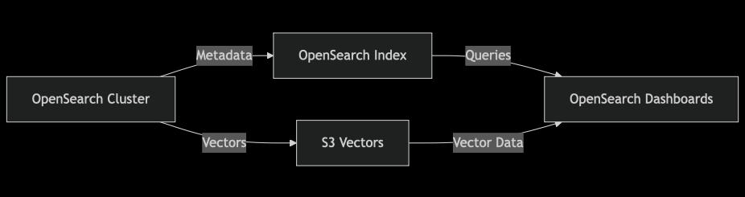

# s3-vectors

## workshop

https://catalog.workshops.aws/s3vectors

## scenarios

### 何时导出到 OpenSearch Serverless

在以下情况下选择导出：

- **实时查询响应**：应用需要 50 毫秒以下的查询响应时间，以提供实时用户体验
- **复杂搜索需求**：需要混合搜索、复杂过滤或超越简单相似性搜索的分析功能
- **无服务器架构**：面对不可预测的流量时，需要自动扩缩容的无服务器基础设施

### 何时直接使用 S3 向量

在以下场景中继续使用 S3 向量：

- **大规模存储**：成本优化是主要考虑因素的大规模存储需求
- **批处理应用**：批处理或能够容忍亚秒级查询延迟的应用场景
- **简单相似性搜索**：只需要相似性搜索，无复杂过滤需求的场景

## integration with AOS

您将集成 Amazon OpenSearch Service 与 Amazon S3 Vectors，实现以下功能：

- 超低存储成本：向量存储在 Amazon S3 Vectors 中，元数据存储在 OpenSearch 中
- 亚秒级查询性能：在成本优化的同时实现快速查询
- 混合搜索能力：将向量相似性搜索与传统文本搜索相结合

### 优势

成本优化：与传统方法相比，显著降低向量存储成本
性能保障：通过智能数据分离，在节约成本的同时保持亚秒级查询性能
混合能力：兼具向量搜索和传统搜索的优势。向量存储在 S3 Vectors 中，元数据存储在 OpenSearch 中
可扩展性：元数据和向量均可自动扩缩容，具备与 Amazon S3 相同的弹性和持久性
标准 API：使用熟悉的 OpenSearch 操作和工具——无需学习新的查询语言

